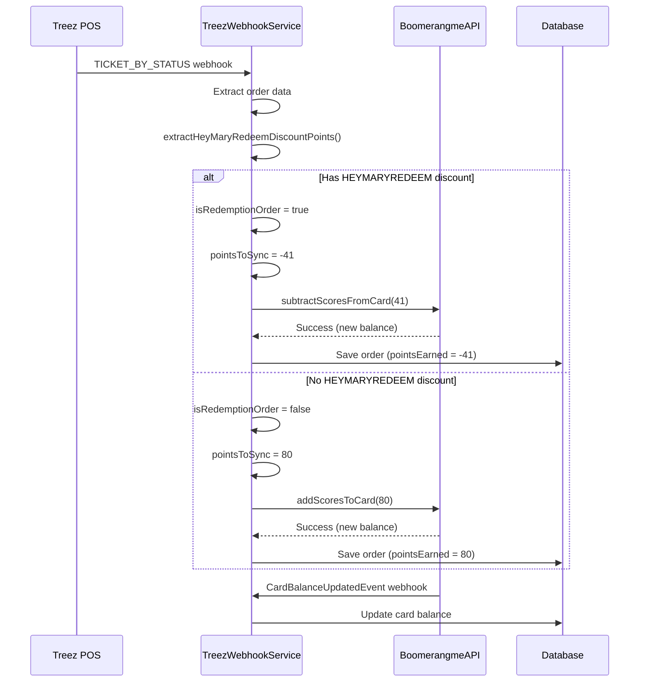

# HEYMARYREDEEM Point Redemption Implementation

## Overview

This document describes the implementation of loyalty point redemption through HEYMARYREDEEM discounts in the HeyMary integration system. When a customer uses their loyalty points at the POS (marked with discount reason "HEYMARYREDEEM"), the system automatically deducts the redeemed points from their Boomerangme card.

## How It Works

### Normal Order (Points Earned)

```
Customer Purchase: $80.79
→ Earns 80 points (1:1 ratio)
→ Points added to Boomerangme card
→ Order saved with pointsEarned = 80
```

### Redemption Order (Points Redeemed)

```
Customer Purchase: $80.79
Customer applies $41 HEYMARYREDEEM discount
→ No points earned from this order
→ 41 points deducted from Boomerangme card
→ Order saved with pointsEarned = -41
```

## Implementation Details

### 1. Discount Detection

**Method:** `extractHeyMaryRedeemDiscountPoints(JsonNode data)`

**Location:** `TreezWebhookService.java`

**Logic:**
1. Iterates through all items in the order (`data.items[]`)
2. For each item, checks the discounts array (`item.discounts[]`)
3. Identifies discounts where `discount_reason == "HEYMARYREDEEM"` (case-insensitive)
4. Sums the absolute values of all HEYMARYREDEEM discount amounts
5. Converts to integer points (rounded down)

**Supported Field Names:**
- `discount_amount`
- `savings`
- `amount`

**Example Treez Webhook Structure:**
```json
{
  "event_type": "TICKET_BY_STATUS",
  "data": {
    "ticket_id": "65655938-17cd-4c4c-90a4-c12ba7ece532",
    "total": 80.79,
    "items": [
      {
        "product_size_name": "Product A",
        "price_sell": 50.00,
        "discounts": [
          {
            "discount_reason": "HEYMARYREDEEM",
            "discount_amount": 30.00
          }
        ]
      },
      {
        "product_size_name": "Product B",
        "price_sell": 30.79,
        "discounts": [
          {
            "discount_reason": "HEYMARYREDEEM",
            "discount_amount": 11.00
          }
        ]
      }
    ]
  }
}
```

In this example:
- Total HEYMARYREDEEM discount: $30 + $11 = $41
- Points to redeem: 41
- Points earned from order: 0 (redemption order)

### 2. Point Calculation Logic

**Updated Method:** `processTicketEvent(IntegrationConfig config, JsonNode eventData)`

**Decision Tree:**
```
Extract HEYMARYREDEEM discounts
    ↓
Has HEYMARYREDEEM? → YES → Redemption Order
    |              ↓
    |         pointsToSync = -heymaryredeemDiscountPoints
    |         Don't earn any points
    |         Call subtractScoresFromCard()
    |
    NO → Normal Order
        ↓
    pointsToSync = orderTotal (1:1 ratio)
    Earn points normally
    Call addScoresToCard()
```

**Key Variables:**
- `heymaryredeemDiscountPoints`: Absolute value of total HEYMARYREDEEM discount (integer)
- `isRedemptionOrder`: Boolean flag (true if heymaryredeemDiscountPoints > 0)
- `pointsToSync`: Can be positive (earned) or negative (redeemed)
- `pointsAction`: "earned" or "redeemed" (for logging)

### 3. API Integration

**Normal Orders:**
```java
boomerangmeApiClient.addScoresToCard(
    apiKey,
    cardId,
    pointsToSync,      // Positive integer
    earnReason,        // "Thank you for your purchase! Order #... | Earned X points..."
    orderTotal         // BigDecimal
)
```

**Redemption Orders:**
```java
boomerangmeApiClient.subtractScoresFromCard(
    apiKey,
    cardId,
    heymaryredeemDiscountPoints,  // Positive integer (absolute value)
    redemptionReason              // "Points redeemed! Order #... - $X.XX discount applied..."
)
```

### 4. Database Schema

**Table:** `orders`

**Column:** `points_earned` (INTEGER)
- **Positive values:** Points earned from purchase
- **Negative values:** Points redeemed through GOODWYLL discount
- **Zero:** Order had no point impact

**Example Records:**
```sql
-- Normal order
externalOrderId: "order-001"
orderTotal: 100.00
pointsEarned: 100

-- Redemption order
externalOrderId: "order-002"
orderTotal: 80.79
pointsEarned: -41
```

### 5. Customer Messages

**Points Earned:**
```
Thank you for your purchase! Order #65655938 - $80.79 | Earned 80 points on Jan 12, 2026
```

**Points Redeemed:**
```
Points redeemed! Order #65655938 - $41.00 discount applied on Jan 12, 2026
```

## Data Flow



## Testing Scenarios

### Test 1: Normal Order (No Discount)

**Setup:**
- Order total: $80.79
- No discounts applied

**Expected Result:**
- Points earned: 80
- Boomerangme API: `addScoresToCard(80)`
- Database: `pointsEarned = 80`
- Log: "Successfully synced Treez transaction ... - 80 points earned (1:1 ratio)"

### Test 2: Simple HEYMARYREDEEM Redemption

**Setup:**
- Order total: $80.79
- HEYMARYREDEEM discount: $41.00

**Expected Result:**
- Points redeemed: 41
- Boomerangme API: `subtractScoresFromCard(41)`
- Database: `pointsEarned = -41`
- Log: "Successfully synced Treez redemption transaction ... - 41 points redeemed"

### Test 3: Multiple HEYMARYREDEEM Discounts

**Setup:**
- Order total: $100.00
- Item 1: HEYMARYREDEEM discount $20.00
- Item 2: HEYMARYREDEEM discount $15.00
- Item 3: HEYMARYREDEEM discount $6.00

**Expected Result:**
- Points redeemed: 41 (sum of all HEYMARYREDEEM discounts)
- Boomerangme API: `subtractScoresFromCard(41)`
- Database: `pointsEarned = -41`

### Test 4: Mixed Discount Types

**Setup:**
- Order total: $100.00
- Discount 1: $10 (reason: "EMPLOYEE") - ignore
- Discount 2: $20 (reason: "HEYMARYREDEEM") - use
- Discount 3: $5 (reason: "SENIOR") - ignore
- Discount 4: $15 (reason: "HEYMARYREDEEM") - use

**Expected Result:**
- Points redeemed: 35 (only HEYMARYREDEEM discounts)
- Other discounts ignored

### Test 5: Negative Discount Values

**Setup:**
- Treez sends: `discount_amount: -41.0`

**Expected Result:**
- System uses absolute value: 41
- Points redeemed: 41

### Test 6: Duplicate Prevention

**Setup:**
- Webhook sent twice for same order
- Order already has `pointsSynced = true`

**Expected Result:**
- Second webhook skipped (no duplicate point deduction)
- Log: "Transaction ... already synced, skipping"

## Logging Examples

### Normal Order Logs

```
INFO  - Processing Treez TICKET (transaction) event for merchant: Evergreen
INFO  - Extracted ticket ID: 65655938-17cd-4c4c-90a4-c12ba7ece532
INFO  - Order 65655938-17cd-4c4c-90a4-c12ba7ece532 validated: status=COMPLETED, payment_status=PAID
DEBUG - No HEYMARYREDEEM discounts found in order
INFO  - Found customer 2162 with Boomerangme card 153111-927-114
INFO  - Saved order 65655938-17cd-4c4c-90a4-c12ba7ece532 to database with 80 points (earned)
INFO  - Adding 80 points to Boomerangme card 153111-927-114 for order 65655938-17cd-4c4c-90a4-c12ba7ece532
INFO  - Successfully sent 80 points to Boomerangme for order 65655938-17cd-4c4c-90a4-c12ba7ece532
INFO  - Successfully synced Treez transaction 65655938-17cd-4c4c-90a4-c12ba7ece532 - 80 points earned (1:1 ratio)
```

### Redemption Order Logs

```
INFO  - Processing Treez TICKET (transaction) event for merchant: Evergreen
INFO  - Extracted ticket ID: abc12345-6789-4def-90gh-ijklmnopqrst
INFO  - Order abc12345-6789-4def-90gh-ijklmnopqrst validated: status=COMPLETED, payment_status=PAID
DEBUG - Found HEYMARYREDEEM discount: $41.0 (original value: $41.0)
INFO  - Extracted 1 HEYMARYREDEEM discount(s) totaling $41.0 (41 points)
INFO  - Order abc12345-6789-4def-90gh-ijklmnopqrst is a HEYMARYREDEEM redemption order - deducting 41 points
INFO  - Found customer 2162 with Boomerangme card 153111-927-114
INFO  - Saved order abc12345-6789-4def-90gh-ijklmnopqrst to database with 41 points (redeemed)
INFO  - Subtracting 41 points from Boomerangme card 153111-927-114 for order abc12345-6789-4def-90gh-ijklmnopqrst
INFO  - Successfully redeemed 41 points from Boomerangme for order abc12345-6789-4def-90gh-ijklmnopqrst
INFO  - Successfully synced Treez redemption transaction abc12345-6789-4def-90gh-ijklmnopqrst - 41 points redeemed
```

## Key Implementation Points

1. **Case-Insensitive Matching:** `discount_reason` is compared case-insensitively ("HEYMARYREDEEM", "heymaryredeem", "HeyMaryRedeem" all work)

2. **Absolute Values:** All discount amounts are converted to absolute values to handle negative numbers from Treez

3. **No Points Earned:** When HEYMARYREDEEM discount is present, the order does NOT earn any points (even if order total > discount)

4. **Sum All HEYMARYREDEEM:** If multiple items have HEYMARYREDEEM discounts, all are summed

5. **Database Compatible:** Integer columns already support negative values, no migration needed

6. **Idempotency:** Existing duplicate prevention still works (checks `pointsSynced` flag)

7. **API Method Ready:** `subtractScoresFromCard` was already implemented and ready to use

## Configuration

No additional configuration required. The feature works automatically based on discount reason detection.

## Troubleshooting

### Issue: Points not being deducted

**Possible Causes:**
1. Discount reason is not exactly "HEYMARYREDEEM"
2. Discount is applied at order level, not item level
3. Discount amount field name is different

**Solution:**
Check logs for:
```
DEBUG - No HEYMARYREDEEM discounts found in order
```

If this appears, verify the webhook JSON structure matches expected format.

### Issue: Wrong amount deducted

**Possible Cause:**
Multiple discounts being summed incorrectly

**Solution:**
Check debug logs:
```
DEBUG - Found HEYMARYREDEEM discount: $X.XX (original value: $Y.YY)
INFO  - Extracted N HEYMARYREDEEM discount(s) totaling $Z.ZZ (P points)
```

### Issue: Duplicate deductions

**Possible Cause:**
Order record not being saved with `pointsSynced = true`

**Solution:**
Verify order record in database has correct status after first webhook.

## Related Files

- **Implementation:** `src/main/java/heymary/co/integrations/service/TreezWebhookService.java`
- **API Client:** `src/main/java/heymary/co/integrations/service/BoomerangmeApiClient.java`
- **Order Model:** `src/main/java/heymary/co/integrations/model/Order.java`
- **Documentation:** This file

## Future Enhancements

Potential improvements for future versions:

1. **Configurable Discount Reason:** Allow merchants to customize the discount reason keyword
2. **Partial Redemptions:** Support using points + cash payment
3. **Redemption Limits:** Prevent redeeming more points than available
4. **Analytics:** Track redemption rates and patterns
5. **Notifications:** Alert merchants when large point redemptions occur

## Version History

- **v1.0** (Jan 2026): Initial implementation with HEYMARYREDEEM discount detection
